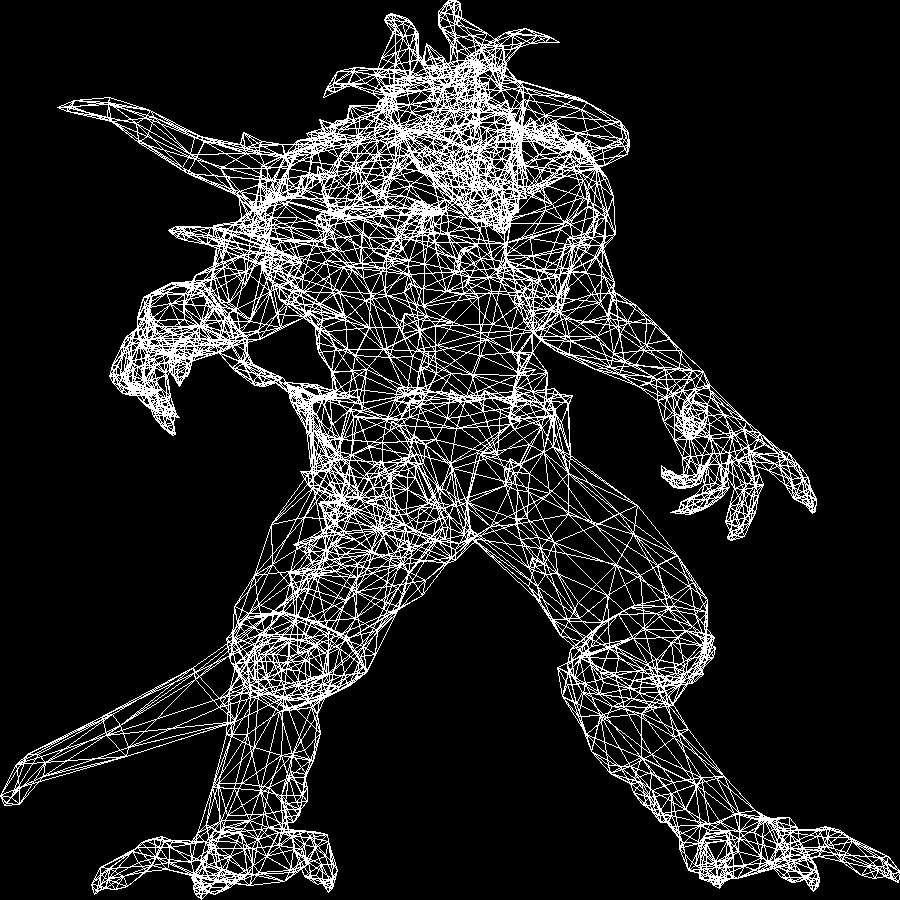

# tinyrenderer

## Overview

This is a software renderer written in Rust capable of rendering simple meshes described in .obj files. The renderer currently supports basic functionalities such as reading vertex positions and rendering them using Bresenham's line algorithm. The goals include extending support to handle normals, texture coordinates, implementing camera and perspective transformations, and basic lighting.

## Features

-   Bresenham's line algorithm for rendering
-   Render meshes from .obj files

## Usage

1.  Clone this repository.
    
    bash
    
    Copy code
    
    `git clone https://github.com/DrainGangScholar/tinyrenderer` 
    
2.  Navigate to the project directory.
    
    bash
    
    Copy code
    
    `cd tinyrenderer` 
    
3.  Compile the renderer.
    
    bash
    
    Copy code
    
    `cargo build --release` 
    
4.  Run the renderer with a sample .obj file.
    
    bash
    
    Copy code
    
    `cargo run --release diablo3_pose.obj` 
    

## Example Output

----------
